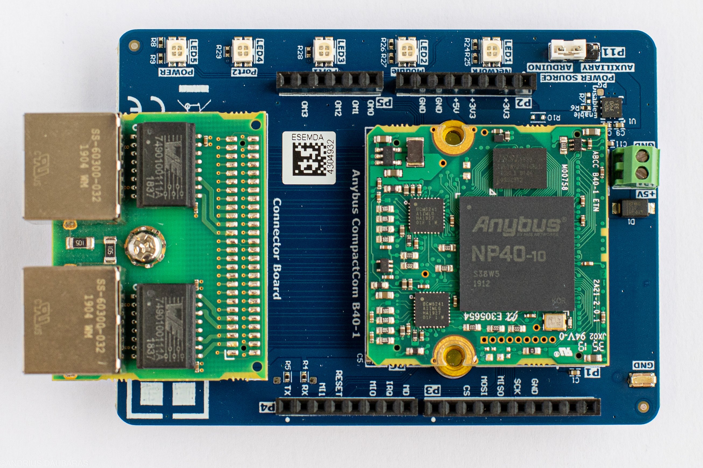
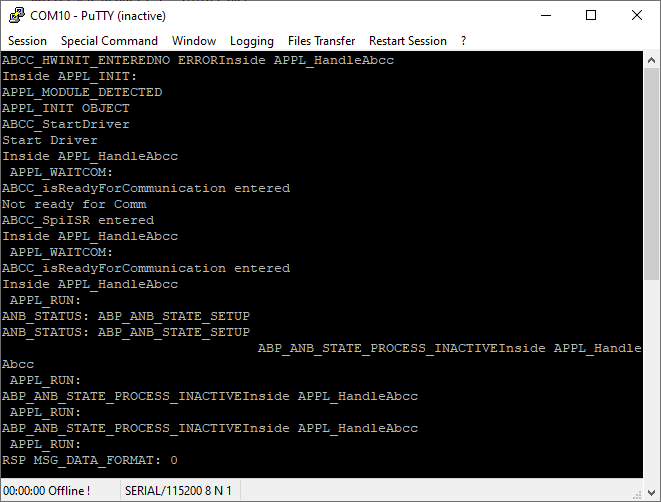
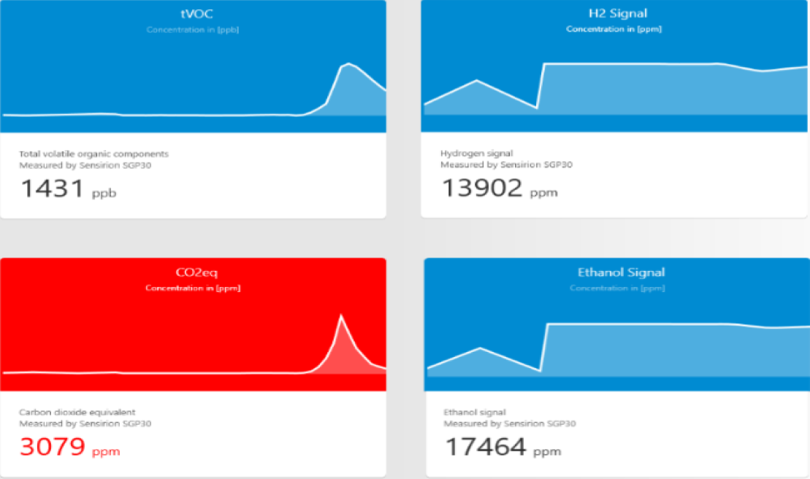
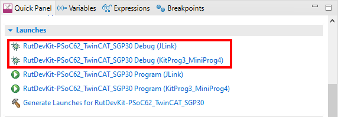

# RutDevKit-PSoC62 TwinCAT SGP30

Rutronik Development Kit Programmable System-on-Chip CY8C6245AZI-S3D72 "RutDevKit-PSoC62 TwinCAT SGP30" Code Example. 

This code example is for the HMS-ANYBUS EtherCAT® demonstration. The HMS Anybus CompactCom B40-1 module [order code: *AB6794*] and B40 Ethernet connector board [order code: AB6666] has to be mounted on the "Rutronik Adapter Board - HMS Anybus" before it is used together with RDK2 board.

This application also requires to have the SGP30 sensor connected with Arduino I2C.

 

## Requirements

- [ModusToolbox® software](https://www.cypress.com/products/modustoolbox-software-environment) v2.4

  

### Using the code example with a ModusToolbox IDE:

1. Import the project: **File** > **Import...** > **General** > **Existing Projects into Workspace** > **Next**.
2. Select the directory where **"RutDevKit-PSoC62_TwinCAT_SGP30"** resides and click  **Finish**.
3. Update libraries using  a **"Library Manager"** tool.
4. Select and build the project **Project ** > **Build Project**.

### Operation

The firmware example uses KitProg3 Debug UART for debug output. LED1 will toggle every time the application ABCC handle is executed successfully. The B40-1 module and RDK2 are communicating over the SPI. The B40-1 module act as a slave device using a EtherCAT protocol for communication with GUI software. The Beckhoffs TwinCAT software enables the PC's Ethernet to work with EtherCAT protocol. The Beckhoffs TwinCAT software needs to be installed on your PC and running with VisualStudio 2013. The GUI example was developed with VisualStudio 2017. Both applications TwinCAT and the GUI need to run simultaneously to share common variables. Please refer to "HMS_AnyBusDemoGuideline" for further information how to setup and use the software.

### Debugging

If you successfully have imported the example, the debug configurations are already prepared to use with a the KitProg3, MiniProg4, or J-link. Open the ModusToolbox perspective and find the Quick Panel. Click on the desired debug launch configuration and wait for the programming completes and debug process starts.

## Legal Disclaimer

The evaluation board including the software is for testing purposes only and, because it has limited functions and limited resilience, is not suitable for permanent use under real conditions. If the evaluation board is nevertheless used under real conditions, this is done at one’s responsibility; any liability of Rutronik is insofar excluded. 

